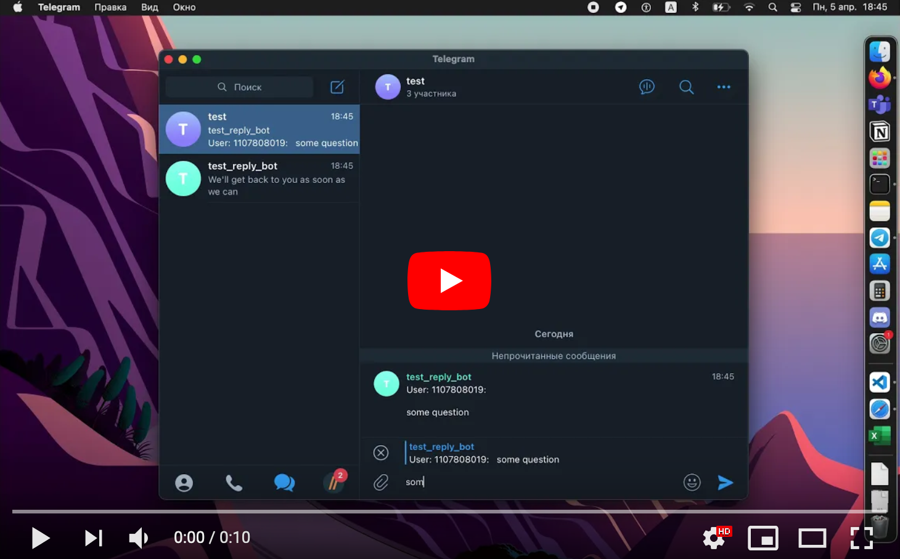

# Telegram Reply Bot

This is a simple Telegram bot that forwards messages sent to it to a group chat and sends back any replies to those messages to the original sender with the prefix reply-bot. The bot is written in TypeScript and uses the Telegraf library.


## Getting started

1. Clone the repository:
```bash
git clone https://github.com/nik19ta/reply-bot.git
```

2. Install dependencies:
```bash
cd reply-bot
npm install
```

3. Create a new Telegram bot and obtain an API token from the [BotFather](https://telegram.me/BotFather).
4. Set the `BOT_TOKEN` environment variable to the API token obtained in the previous step:

```bash
BOT_TOKEN=<your-bot-api-token>
```

5. Create a new group chat in Telegram and invite your bot to it.

6. Set the `GROUP_ID` environment variable to the ID of the group chat you just created. You can obtain the chat ID by adding the bot to the group and sending a message to it, then running the following command:

```bash
curl -X POST https://api.telegram.org/bot<your-bot-api-token>/getUpdates
```

7. Look for the chat object in the JSON response and copy the value of the id field.

8. Set the `GROUP_ID` environment variable
```bash
GROUP_ID=<your-group-id>
```

Start the bot:

```bash
npm start
```

## Usage
Send a message to the bot and it will be forwarded to the group chat. If anyone in the group replies to that message, the bot will send the reply back to the original sender with the prefix `reply-bot`.

## Demo:

[](https://youtu.be/TeOwEtaCdAk)

## License
This project is licensed under the MIT [License](https://github.com/nik19ta/reply-bot/blob/master/LICENSE.md). See the LICENSE file for details.
